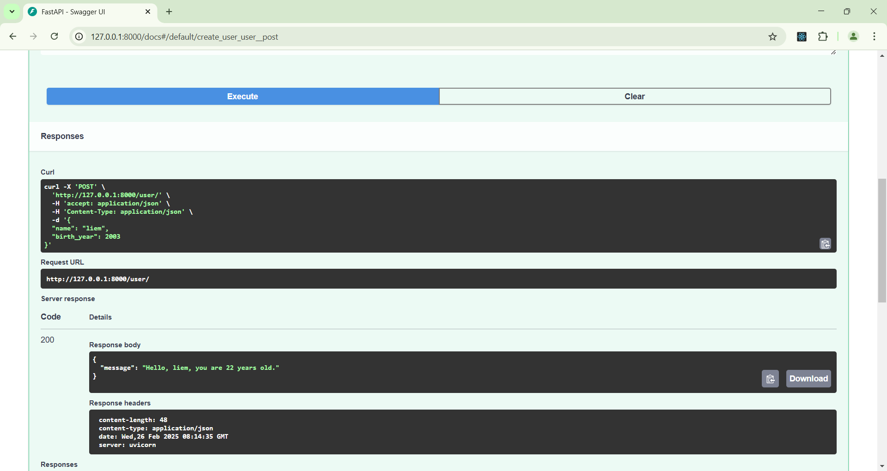
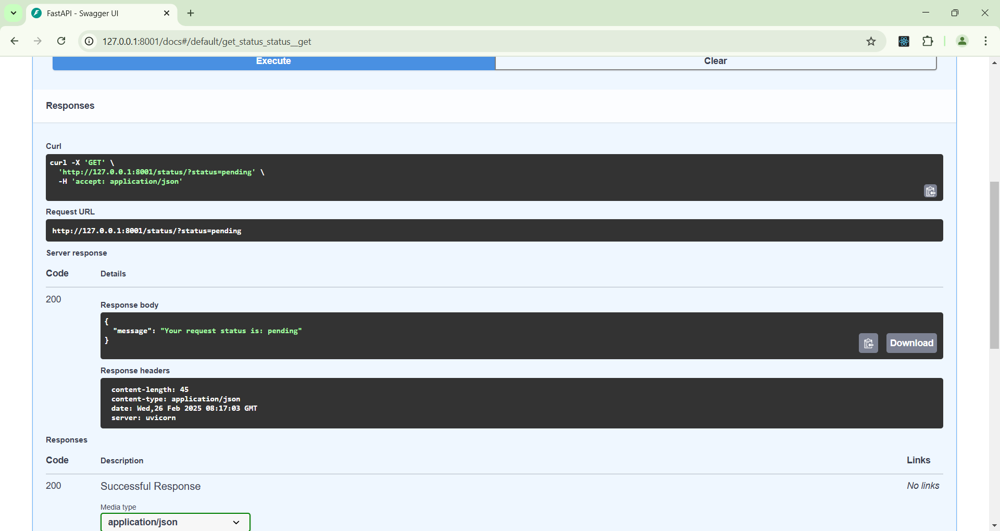
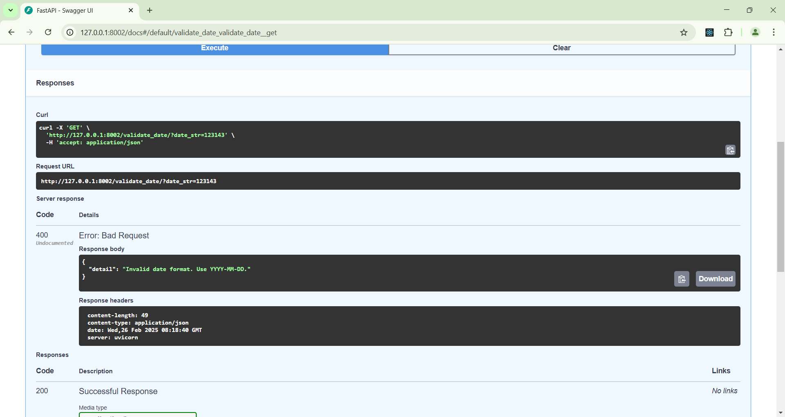
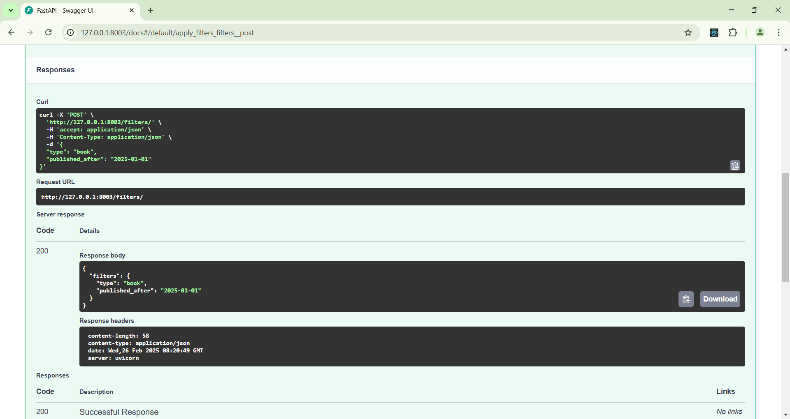
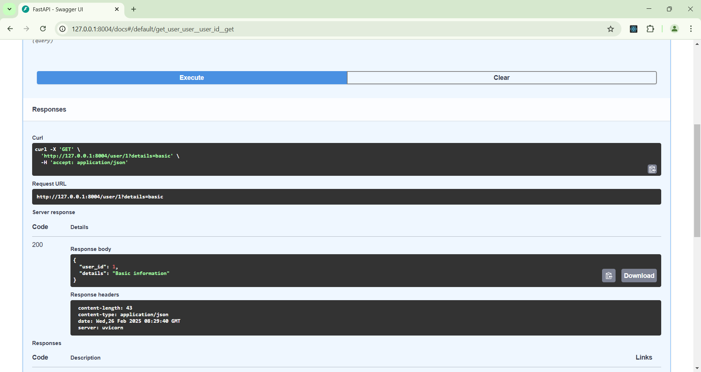
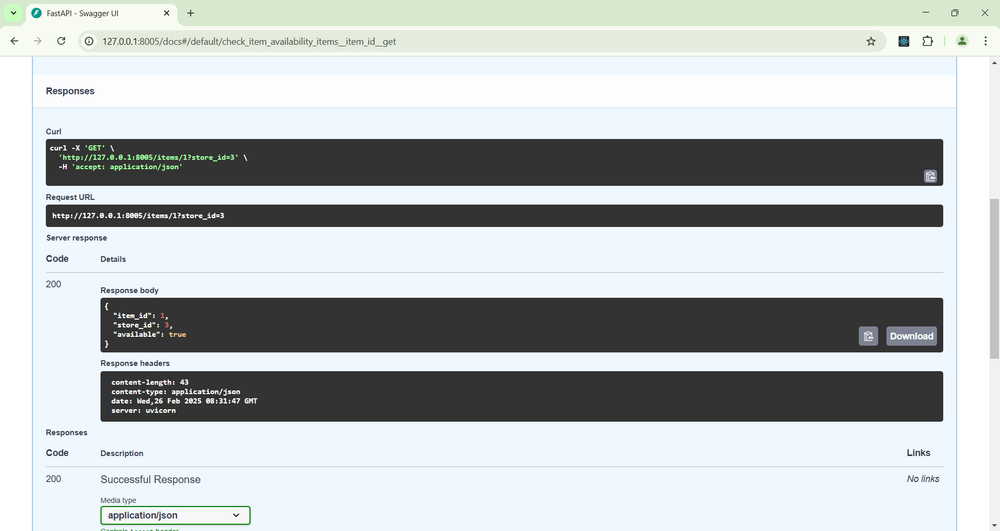
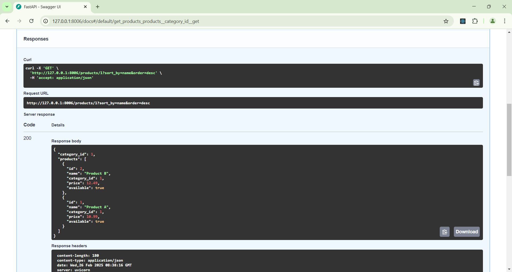

# SOA - HOMEWORK 05

```sh
Huynh Thanh Liem - 52100813
```

## Dependencies

To run this project, you need to install the following dependencies:

- **FastAPI**: A modern, fast (high-performance), web framework for building APIs with Python 3.6+ based on standard Python type hints.
- **Uvicorn**: A lightning-fast ASGI server implementation, using `uvloop` and `httptools`.

You can install these dependencies using pip. It is recommended to create a virtual environment before installing the packages.

### Installation Instructions

1. **Create a virtual environment (optional but recommended)**:
  ```bash
  python -m venv venv
  source venv/bin/activate  # On Windows use `venv\Scripts\activate`
  ```
  ```sh
  pip install fastapi uvicorn
  ```
## Exercises

#### Exercise 6: Endpoint for User ID and Age



#### Exercise 7: Endpoint for Status



#### Exercise 8: Endpoint for Date Validation



#### Exercise 9: Endpoint for JSON Filters



#### Exercise 10: Endpoint for User ID and Details



#### Exercise 11: Endpoint for Item ID and Store ID



#### Exercise 12: Endpoint for Category ID

please intsall pandas for this exercise

```sh
pip install pandas
```

